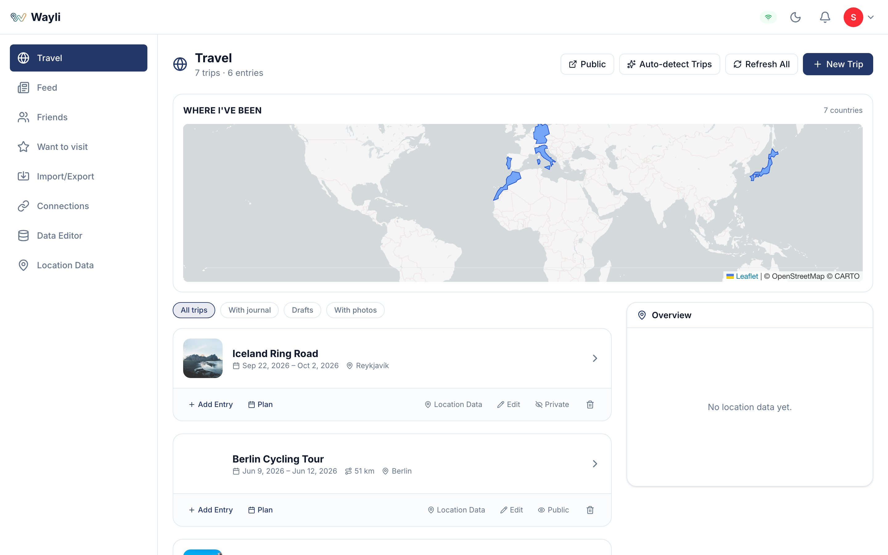
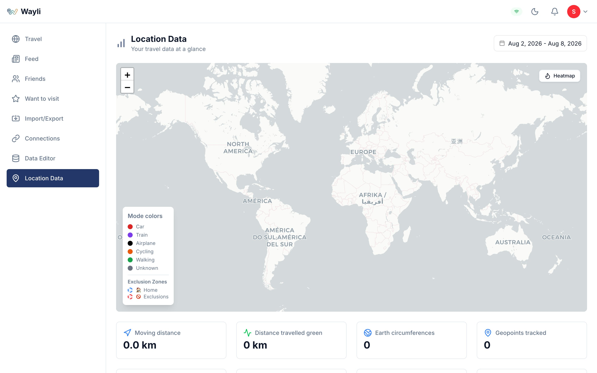
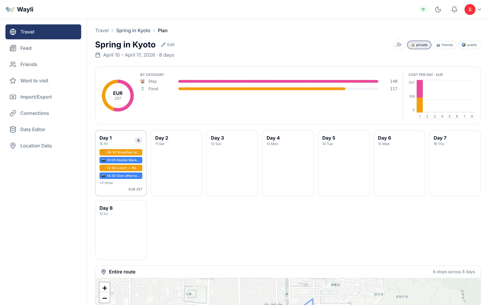
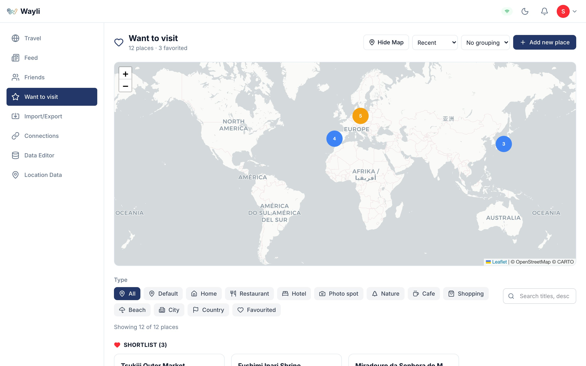
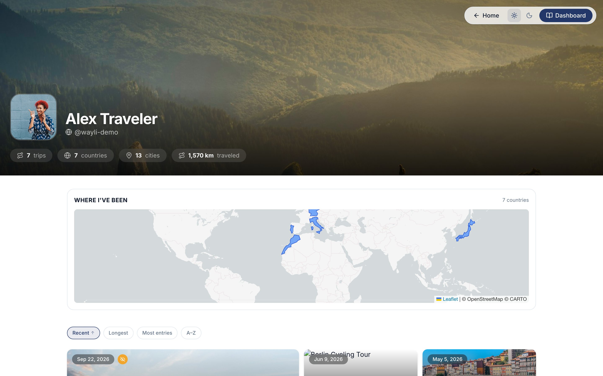
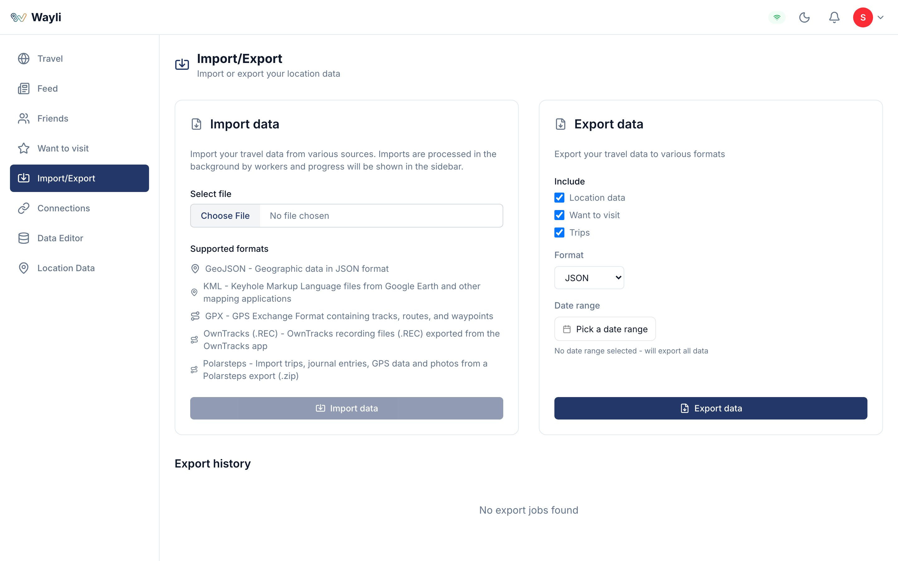

<div align="center">


# Wayli
</div>

[](https://github.com/nimbleflux/wayli/actions/workflows/ci.yml)
[](https://github.com/nimbleflux/wayli/actions/workflows/release.yml)
[](https://opensource.org/licenses/AGPL-3.0)
[](https://github.com/nimbleflux/wayli/releases)

<p align="center">
  <a href="https://buymeacoffee.com/nimbleflux" target="_blank" rel="noopener">
    
  </a>
</p>

Privacy-first location tracking and trip analysis. Self-hosted, no third-party data sharing.

## Features

- **Trip Detection** - Automatically detects trips from GPS data with transport mode classification
- **Statistics** - Distance traveled, transport modes, and interactive visualizations
- **Data Export** - Export everything in JSON, GeoJSON, or CSV
- **Privacy-First Geocoding** - Uses [Pelias](https://pelias.io), an open-source geocoder, keeping location lookups off commercial services
- **OwnTracks Integration** - Import location data from OwnTracks

## Screenshots

<table>
  <tr>
    <td width="50%" align="center">
      
      <br/><sub><b>Travel overview</b> — the "Where I've Been" world map, trip cards, and sticky overview map.</sub>
    </td>
    <td width="50%" align="center">
      
      <br/><sub><b>Statistics</b> — interactive maps, transport-mode segments, heatmaps, and activity calendar.</sub>
    </td>
  </tr>
  <tr>
    <td width="50%" align="center">
      
      <br/><sub><b>Trip planner</b> — day-by-day itineraries with a budget dashboard.</sub>
    </td>
    <td width="50%" align="center">
      
      <br/><sub><b>Want-to-visit</b> — a map of places to explore with custom markers and ratings.</sub>
    </td>
  </tr>
  <tr>
    <td width="50%" align="center">
      
      <br/><sub><b>Public profile</b> — share your travels with stats, a world map, and a trip grid.</sub>
    </td>
    <td width="50%" align="center">
      
      <br/><sub><b>Import / Export</b> — bring in GPX, KML, GeoJSON, OwnTracks, and Polarsteps.</sub>
    </td>
  </tr>
</table>

Screenshots are generated from synthetic data — see [`docs/REGENERATING-SCREENSHOTS.md`](docs/REGENERATING-SCREENSHOTS.md) to reproduce them.

## Tech Stack

- **Frontend**: SvelteKit, TypeScript, Tailwind CSS
- **Backend**: [Fluxbase](https://fluxbase.eu) (PostgreSQL, Auth, Storage, Jobs)
- **Geocoding**: Pelias (self-hostable, privacy-preserving)
- **Mapping**: Leaflet

## Quick Start

**Docker Compose:**
```bash
cd deploy/docker-compose
./generate-keys.sh          # generates secrets + writes .env (prompts for URLs)
docker compose up -d        # brings up web + Fluxbase + Postgres
# Wayli:          http://localhost:4000
# Fluxbase admin: http://localhost:8080/admin/setup (token from generate-keys.sh)
```

The Wayli web image runs `sync:all` on startup, so `docker compose up` applies the
declarative schema (`fluxbase/schema/public.sql`), RPC, jobs, and RLS policies
automatically — no separate migration step.

**Kubernetes (Helm):**
```bash
helm install wayli oci://ghcr.io/nimbleflux/charts/wayli -n wayli --create-namespace
```

See the [Deployment Guide](deploy/README.md) for detailed instructions.

## Development

Wayli uses [Bun](https://bun.sh) (not npm). Start a local Fluxbase + Postgres stack
first (devcontainer or the docker-compose Quick Start above), then:

```bash
cd web
bun install
bun run dev:all    # syncs Fluxbase resources (sync:all) then starts the app on :4000
```

The app runs on `http://localhost:4000`. See [CLAUDE.md](CLAUDE.md) for development
conventions and [web/README.md](web/README.md) for architecture details.

## Verifying a release

Before tagging a release, verify the documented deployment path end-to-end:

```bash
# From web/ — builds the prod image, brings up an isolated stack, runs the smoke,
# and tears everything down (containers, volumes, network):
bun run verify:setup
```

This automates the same `docker compose up` path a self-hoster follows and asserts
the happy path works: stack comes up healthy, schema + RLS apply automatically on
container boot, the first user can sign up (becomes admin) and sign in, and the
dashboard renders without server errors. The same smoke also runs in CI as the
`Setup smoke (docker compose up)` job on every PR.

To run just the Playwright smoke against a stack you've already started:

```bash
bun run test:setup
```

## Privacy

Your location data is sensitive. Wayli is designed to be self-hosted, giving you complete control over your data. All trip data, place visits, and personal information stay on your server.

For geocoding, Wayli uses a hosted [Pelias](https://pelias.io) instance at `pelias.wayli.app` by default (a Wayli-managed server)—coordinates are sent for address lookup but no user information is included and nothing is persisted. You can also self-host Pelias for complete independence.

## Contributing

See [CONTRIBUTING.md](CONTRIBUTING.md) for guidelines.

## License

AGPL-3.0. See [LICENSE](LICENSE).
