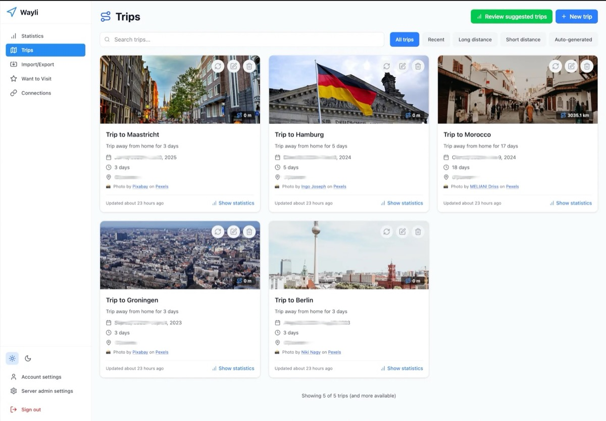

<div align="center">


# Wayli
</div>

[](https://github.com/nimbleflux/wayli/actions/workflows/ci.yml)
[](https://github.com/nimbleflux/wayli/actions/workflows/release.yml)
[](https://opensource.org/licenses/AGPL-3.0)
[](https://github.com/nimbleflux/wayli/releases)

<p align="center">
  <a href="https://buymeacoffee.com/nimbleflux" target="_blank" rel="noopener">
    
  </a>
</p>

Privacy-first location tracking and trip analysis. Self-hosted, no third-party data sharing.

## Features

- **Trip Detection** - Automatically detects trips from GPS data with transport mode classification
- **Statistics** - Distance traveled, transport modes, and interactive visualizations
- **Data Export** - Export everything in JSON, GeoJSON, or CSV
- **Privacy-First Geocoding** - Uses [Pelias](https://pelias.io), an open-source geocoder, keeping location lookups off commercial services
- **OwnTracks Integration** - Import location data from OwnTracks

## Screenshots

<div align="center">


*Automatically detected trips with cover photos and transport modes*


*Distance traveled, transport modes, and interactive maps*

</div>

## Tech Stack

- **Frontend**: SvelteKit, TypeScript, Tailwind CSS
- **Backend**: [Fluxbase](https://fluxbase.eu) (PostgreSQL, Auth, Storage, Jobs)
- **Geocoding**: Pelias (self-hostable, privacy-preserving)
- **Mapping**: Leaflet

## Quick Start

**Docker Compose:**
```bash
cd deploy/docker-compose
./generate-secrets.sh
# Edit .env with your configuration
docker compose up -d
```

**Kubernetes (Helm):**
```bash
helm install wayli oci://ghcr.io/nimbleflux/charts/wayli -n wayli --create-namespace
```

See the [Deployment Guide](deploy/README.md) for detailed instructions.

## Development

```bash
cd web
npm install
npm run dev
```

See [CLAUDE.md](CLAUDE.md) for development conventions and [web/README.md](web/README.md) for architecture details.

## Privacy

Your location data is sensitive. Wayli is designed to be self-hosted, giving you complete control over your data. All trip data, place visits, and personal information stay on your server.

For geocoding, Wayli uses a hosted [Pelias](https://pelias.io) instance at `pelias.wayli.app` by default (a Wayli-managed server)—coordinates are sent for address lookup but no user information is included and nothing is persisted. You can also self-host Pelias for complete independence.

## Contributing

See [CONTRIBUTING.md](CONTRIBUTING.md) for guidelines.

## License

AGPL-3.0. See [LICENSE](LICENSE).
