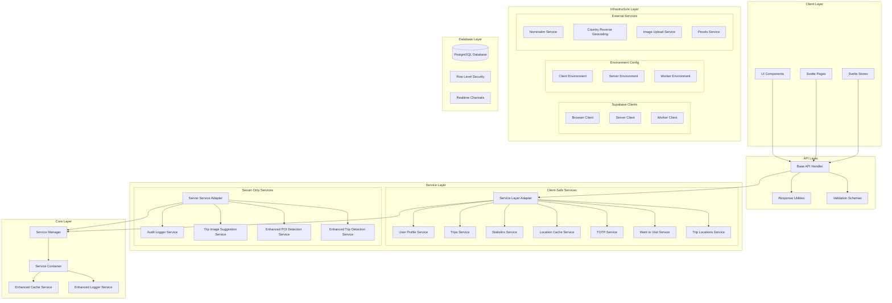

# Wayli - Privacy-First Location Tracking App 🗺️

Alright, so... Wayli is basically this privacy-first location analysis app. The whole thing is kind of a love letter to people who want to track their travels without selling their soul to big tech.

It started as vibes but somehow ended up with... actual architecture? 🤷‍♂️

## ✨ Features

- **🔒 Privacy-First**: Your data stays yours - no tracking, no ads, no data sharing
- **🗺️ Location Tracking**: Track your movements with customizable privacy settings
- **✈️ Trip Management**: Organize and plan your travels with rich metadata
- **📊 Statistics & Analytics**: Visualize your travel patterns and insights
- **🌍 Geocoding**: Automatic location detection and reverse geocoding
- **📱 Responsive Design**: Works seamlessly on desktop and mobile
- **♿ Accessibility**: WCAG 2.1 AA compliant with full keyboard navigation
- **🌙 Dark Mode**: Beautiful light and dark themes
- **🔐 Two-Factor Authentication**: Enhanced security for your account
- **📤 Data Export**: Export your data in multiple formats (JSON, GeoJSON, CSV)

## 🏗️ Architecture

Wayli uses a modern, layered architecture with clear separation of concerns:



## 🚀 Quick Start

### Prerequisites

- Node.js 18+
- npm or yarn
- Supabase account and project

### Installation

1. **Clone the repository**

   ```bash
   git clone https://github.com/wayli-app/wayli.git
   cd wayli/web
   ```

2. **Install dependencies**

   ```bash
   npm install
   ```

3. **Set up environment variables**

   ```bash
   cp .env.example .env
   ```

   Edit `.env` with your Supabase credentials:

   ```env
   PUBLIC_SUPABASE_URL=your_supabase_url
   PUBLIC_SUPABASE_ANON_KEY=your_supabase_anon_key
   SUPABASE_SERVICE_ROLE_KEY=your_service_role_key
   ```

4. **Run database migrations**

   ```bash
   npx supabase db reset
   ```

5. **Start the development server**

   ```bash
   npm run dev
   ```

6. **Open your browser**
   Navigate to `http://localhost:5173`

## 🧪 Testing

Wayli has comprehensive test coverage across all layers:

```bash
# Run all tests
npm test

# Run tests with coverage
npm run test:coverage

# Run specific test categories
npm test -- tests/unit/          # Unit tests
npm test -- tests/components/    # Component tests
npm test -- tests/accessibility/ # Accessibility tests
npm test -- tests/integration/   # Integration tests
```

### Test Coverage Goals

- **Total Coverage**: 85%+
- **Business Logic**: 90%+
- **API Layer**: 85%+
- **Components**: 80%+
- **Accessibility**: 100%

## 🔧 Development

### Project Structure

```
web/
├── src/
│   ├── lib/
│   │   ├── accessibility/       # Accessibility utilities
│   │   ├── components/          # Reusable UI components
│   │   ├── core/
│   │   │   ├── config/          # Environment configuration
│   │   │   └── supabase/        # Supabase clients
│   │   ├── services/           # Business logic services
│   │   ├── stores/             # Svelte stores
│   │   ├── types/              # TypeScript types
│   │   ├── utils/
│   │   │   ├── api/            # API utilities and patterns
│   │   │   └── ...             # Other utilities
│   │   ├── validation/         # Zod validation schemas
│   │   └── middleware/         # Request middleware
│   ├── routes/
│   │   ├── (user)/             # Protected user routes
│   │   ├── api/                # API endpoints
│   │   └── setup/              # Initial setup flow
│   └── static/                 # Static assets
├── tests/                      # Test suite
│   ├── unit/                   # Unit tests
│   ├── components/             # Component tests
│   ├── integration/            # Integration tests
│   └── accessibility/          # Accessibility tests
└── docs/                       # Documentation
```

### Key Technologies

- **Frontend**: SvelteKit, TypeScript, Tailwind CSS
- **Backend**: Supabase (PostgreSQL, Auth, Storage)
- **Testing**: Vitest, Testing Library
- **Validation**: Zod
- **Deployment**: Vercel

### Development Guidelines

- **TypeScript**: Strict mode enabled, no `any` types
- **Accessibility**: WCAG 2.1 AA compliance required
- **Testing**: Comprehensive test coverage for all features
- **API Design**: RESTful endpoints with consistent response formats
- **Security**: Row-level security, input validation, authentication

## 🔒 Security & Privacy

### Privacy Features

- **Local Processing**: Location data processed locally when possible
- **Data Ownership**: You own your data - no sharing with third parties
- **Transparent**: Open source code for full transparency
- **Minimal Collection**: Only collect data necessary for functionality

### Security Features

- **Authentication**: Supabase Auth with 2FA support
- **Authorization**: Row-level security policies
- **Input Validation**: Comprehensive Zod schema validation
- **Error Handling**: Secure error responses without data leakage
- **HTTPS**: All communications encrypted

## ♿ Accessibility

Wayli is built with accessibility as a core principle:

- **WCAG 2.1 AA Compliant**: Meets international accessibility standards
- **Keyboard Navigation**: Full keyboard support for all features
- **Screen Reader Support**: Semantic HTML and ARIA attributes
- **High Contrast**: Support for high contrast mode
- **Focus Management**: Proper focus indicators and management

## 🌍 Environment Configuration

Wayli uses a secure, layered environment configuration:

### Client-Safe Configuration

```typescript
// Note: Nominatim configuration is now handled directly in the service
// No client-side config needed at this time
```

### Server-Only Configuration

```typescript
// src/lib/core/config/server-environment.ts
// Server-only variables from $env/static/private
export function validateServerEnvironment() {
	// Validate required environment variables
}
```

### Vite Configuration

```typescript
// vite.config.ts
// Preview server allowed hosts configuration
export default defineConfig({
  preview: {
    allowedHosts: [
      'localhost',
      '127.0.0.1',
      // Allow production domains from environment variable
      ...(process.env.VITE_ALLOWED_HOSTS ? process.env.VITE_ALLOWED_HOSTS.split(',') : []),
      'wayli.app',
      '.wayli.app'
    ]
  }
});
```

**Environment Variables:**
- `VITE_ALLOWED_HOSTS`: Comma-separated list of allowed hosts for preview server
  - Example: `VITE_ALLOWED_HOSTS=wayli.app,staging.wayli.app,dev.wayli.app`
  - Default: `wayli.app` and `.wayli.app` (with subdomain support)

**Note**: The `allowedHosts` check prevents host header attacks during development/preview. Since you're using HTTPS in production, this provides minimal additional security benefit.

**Production Deployment**: The Docker container uses nginx to serve static files instead of running a Node.js server, which is much more efficient and production-ready.

**Docker Architecture**: Multi-stage build with nginx for web serving and Node.js for background workers.

## 🐳 Docker

### Container Architecture

The Dockerfile uses a multi-stage build approach:

- **`web` stage**: nginx serving static files (port 80)
- **`worker` stage**: Node.js for background processing
- **`builder` stage**: Builds the SvelteKit application

### Container Modes

The Docker container supports multiple modes via the `APP_MODE` environment variable:

- **`APP_MODE=web`**: Use the nginx stage (static file serving)
- **`APP_MODE=worker`**: Run a background worker process
- **`APP_MODE=workers`**: Run the worker manager

### Building and Running

```bash
# Build the container
docker build -t wayli-web .

# Run web stage (nginx) - serves static files on port 80
docker run -p 80:80 wayli-web:web

# Run worker stage - background processing
docker run -e APP_MODE=worker wayli-web:worker

# Run worker manager stage
docker run -e APP_MODE=workers wayli-web:worker
```

### Testing

Use the provided test script to verify the container works:

```bash
./test-container.sh
```

### Production Deployment

When deploying to production, you may need to set the `VITE_ALLOWED_HOSTS` environment variable:

```bash
# For Vercel, add to your environment variables:
VITE_ALLOWED_HOSTS=wayli.app,staging.wayli.app

# For other platforms, add to your .env file:
VITE_ALLOWED_HOSTS=wayli.app,staging.wayli.app,dev.wayli.app
```

This prevents the "Blocked request. This host is not allowed" error when accessing your app from production domains.

## 📚 Documentation

- **[AI.MD](AI.MD)**: Comprehensive development guidelines
- **[API Documentation](src/lib/utils/api/README.md)**: API patterns and usage
- **[Testing Guide](tests/README.md)**: Testing strategy and patterns
- **[Contributing Guide](CONTRIBUTING.md)**: How to contribute to the project

## 🤝 Contributing

We welcome contributions! Please see our [Contributing Guide](CONTRIBUTING.md) for details.

### Development Setup

1. Fork the repository
2. Create a feature branch
3. Make your changes
4. Add tests for new functionality
5. Ensure all tests pass
6. Submit a pull request

### Code Standards

- Follow TypeScript strict mode
- Write comprehensive tests
- Ensure accessibility compliance
- Follow the established API patterns
- Update documentation as needed

## 📄 License

This project is licensed under the MIT License - see the [LICENSE](LICENSE) file for details.

## 🙏 Acknowledgments

- [SvelteKit](https://kit.svelte.dev/) for the amazing framework
- [Supabase](https://supabase.com/) for the backend infrastructure
- [Tailwind CSS](https://tailwindcss.com/) for the styling system
- [Vitest](https://vitest.dev/) for the testing framework
- [Zod](https://zod.dev/) for runtime validation

## 📞 Support

- **Issues**: [GitHub Issues](https://github.com/your-username/wayli/issues)
- **Discussions**: [GitHub Discussions](https://github.com/your-username/wayli/discussions)
- **Documentation**: [Project Wiki](https://github.com/your-username/wayli/wiki)

---

**Made with ❤️ for travelers who value privacy and control over their data.**
